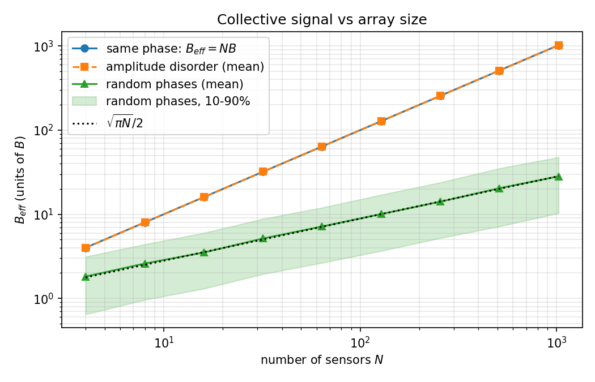
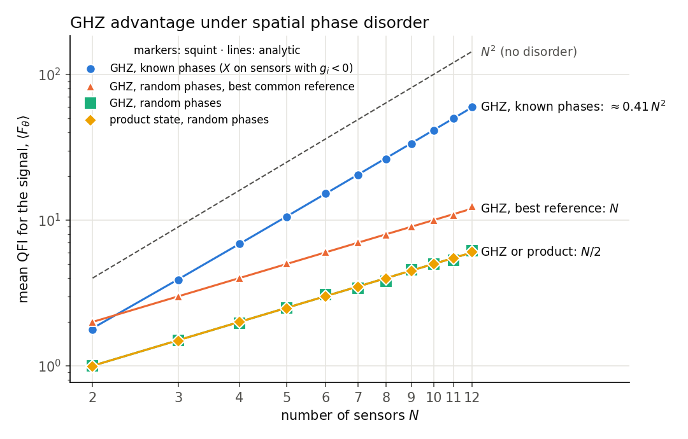

# AC Quantum Sensing Array Simulation

[](https://github.com/HelioXv022/Quantum-Sensing/actions/workflows/ci.yml)

A small Python model of collective AC field sensing with an array of quantum sensors. It shows how spatial phase disorder removes the coherent enhancement of a GHZ-like probe: the collective signal drops from growing like $N$ to growing like $\sqrt{N}$. A second part computes the quantum Fisher information of GHZ and product probes with [squint](https://github.com/benjimaclellan/squint) and shows how much of the Heisenberg scaling survives the disorder.

## Model

Sensor $i$ sees a local signal with amplitude $B_i$ and phase $\phi_i$. In a collective protocol the local signals add as phasors,

$$
B_{\rm eff} = \Big|\sum_i B_i e^{i\phi_i}\Big| ,
$$

and the probe accumulates a phase $\Theta(T) = 2 B_{\rm eff} T$. The trace distance between the no-signal and signal states is

$$
D(T) = \left|\sin\frac{\Theta(T)}{2}\right| ,
$$

so the time needed to reach a fixed distinguishability scales as $1/B_{\rm eff}$.

Three arrays are compared:

| Case | Amplitudes | Phases | Typical $B_{\rm eff}$ |
| --- | --- | --- | --- |
| Homogeneous | $B_i = B$ | $\phi_i = \phi$ | $NB$ |
| Amplitude disorder | random $B_i$ | $\phi_i = \phi$ | $\approx NB$ |
| Phase disorder | $B_i = B$ | random $\phi_i$ | $\approx \tfrac{\sqrt{\pi N}}{2}B$ |

The code also plots two heuristic sensing-time scalings for an unknown frequency in a band $\Delta\omega$: conventional scanning, $\tau_{\rm conv} \sim \Delta\omega / B_{\rm eff}^2$, and quantum search sensing, $\tau_{\rm QSS} \sim \sqrt{\Delta\omega} / B_{\rm eff}^{3/2}$, following Allen et al. (below). These are scaling estimates with constants dropped, not a simulation of the QSS oracle.

## Result



Averaged over 2000 random arrays per size, the random-phase signal follows the random-walk mean $\sqrt{\pi N}/2$ with a fitted exponent of 0.495. Amplitude disorder with a 35% spread leaves $B_{\rm eff}$ within a fraction of a percent of $NB$ on average. At $N = 1024$ the phase-disordered array needs about 36 times longer than the coherent one to reach the same trace distance.

## Quantum Fisher information with squint

The phasor sum above is a proxy. The quantity that bounds the precision of any estimator is the quantum Fisher information (QFI) of the probe state. `qsensing.fisher` builds the probe circuit in [squint](https://github.com/benjimaclellan/squint) with one $R_z$ gate per sensor inside a `Block`, so a single call returns the $N \times N$ QFI matrix $F$ over the local phases. For a signal $\theta$ that reaches sensor $i$ with coupling $g_i = \cos\phi_i$,

$$
F_\theta = g^{\mathsf T} F\, g .
$$

For $|{+}\rangle^{\otimes N}$, $F$ is the identity, so $F_\theta = \sum_i g_i^2$. For a GHZ state, $F$ is the all-ones matrix: the probe only sees the sum of the local phases, so $F_\theta = (\sum_i g_i)^2$. An $X$-basis readout reaches the QFI in both cases (CFIM = QFIM in the tests).



With uniformly random phases the GHZ advantage disappears: both probes average $N/2$. Choosing the best common reference phase gives $|\sum_i e^{i\phi_i}|^2$, which averages $N$ and is exactly $B_{\rm eff}^2$ from the phasor model above (in units of $B^2$). If the phases are known, applying $X$ to the sensors with $g_i < 0$ after preparing the GHZ state flips their sign and recovers Heisenberg scaling, $\langle F_\theta\rangle \approx (2/\pi)^2 N^2 \approx 0.41\,N^2$. The squint results (markers) agree with these analytic averages for $N = 2$ to $12$.

## Usage

Requires Python 3.10+.

```bash
python -m venv .venv && source .venv/bin/activate
pip install -e ".[test]"

python -m qsensing --out figures/          # three-case comparison on a 6x6 array
python -m qsensing.scaling --out figures/  # B_eff vs N, as in the figure above
pytest                                     # tests

# Fisher-information study (needs Python 3.11+ for squint)
pip install -e ".[test,squint]"
python -m qsensing.disorder --out figures/ # QFI vs N under phase disorder
```

`python -m qsensing --help` lists the options (array size, seed, amplitude spread, target success probability).

## Layout

```text
qsensing/
  model.py      effective signal, trace distance, detection time, case generation
  plots.py      figures for the three-case comparison
  scaling.py    ensemble study of B_eff vs N
  fisher.py     QFIM and CFIM over the local phases, computed with squint
  disorder.py   disorder-averaged QFI of GHZ and product probes
  __main__.py   command-line entry point
tests/          pytest suite
```

## References

- B. MacLellan, P. Roztocki, S. Czischek and R. G. Melko, *End-to-end variational quantum sensing*, [arXiv:2403.02394](https://arxiv.org/abs/2403.02394) (2024), and the [squint](https://github.com/benjimaclellan/squint) package.
- R. R. Allen, F. Machado, I. L. Chuang, H.-Y. Huang and S. Choi, *Quantum Computing Enhanced Sensing*, [arXiv:2501.07625](https://arxiv.org/abs/2501.07625) (2025).

## License

MIT
